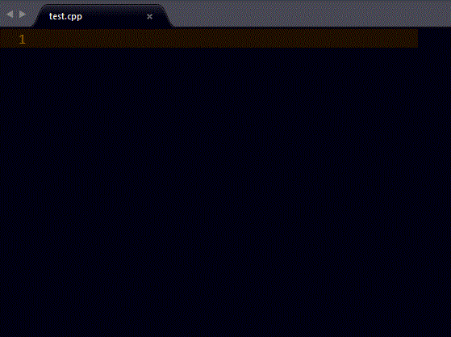

# Qt AutoComplete for C++

A Sublime text package that pops up suggestions/Autocomplete for Qt Classes, Functions, Modules and Namespaces. It's purpose is to make coding easier and faster without the need for memorizing component names.

## Screenshot

## Installation
> Important: You need to have `Package Control` installed first on your sublime text which can be found at [The Package Contol Website](http://packagecontrol.io)

### Using Package Control's Repository

Go to `Preferences` --> `Package Control` --> `Add Repository` --> then type into the textbox `https://github.com/tushortz/Qt-AutoComplete=for-Cpp`

After doing this, then go to: `Preferences` --> `Package Control` --> `Install Package` --> then search `Qt AutoComplete for C++` and click it.

The package will be installed and ready for use.

### Download Manually

* Download the files using the GitHub .zip download option
* Unzip the files
* Copy the folder to your Sublime Text `Packages` directory

## How to Use

All Classes, Modules and Namespace autocomplete can be activated by typing part of its name( in Upper case)and pressing TAB to select. Some functions are also activated in Upper-case Mode but most functions are activated in Lowercase

## Example

> Note: All the string with bold below is used to specify which case it should begin with.

| Component Usage    | Package display          | Package Type |
| :-------------:    | :-------------:          | :-----:      |
| **s**etMaximumSize | `setMaximumSize();`      |  Methods     |
| **Q**tWidgets      | `#include <QtWidgets>`   |  Modules     |
| **Q**Label         | `QLabel`                 |  Classes     |
| **Q**Audio         | `#include <QAudio>`      |  Namespaces  |

## Contributing

All contributions are welcome. You can fork it on [Github](https://github.com/tushortz/Qt-AutoComplete-for-Cpp)

## License
© 2015 Taiwo Kareem | taiwo.kareem36@gmail.com.

Permission is hereby granted, free of charge, to any person obtaining a copy
of this software and associated documentation files (the "Software"), to deal
in the Software without restriction, including without limitation the rights
to use, copy, modify, merge, publish, distribute, sublicense, and/or sell
copies of the Software, and to permit persons to whom the Software is
furnished to do so, subject to the following conditions:

The above copyright notice and this permission notice shall be included in
all copies or substantial portions of the Software.

## Acknowledgements
I'd first like to say a very big thank you to God my creator. Without him, this wouldn't be possible.

